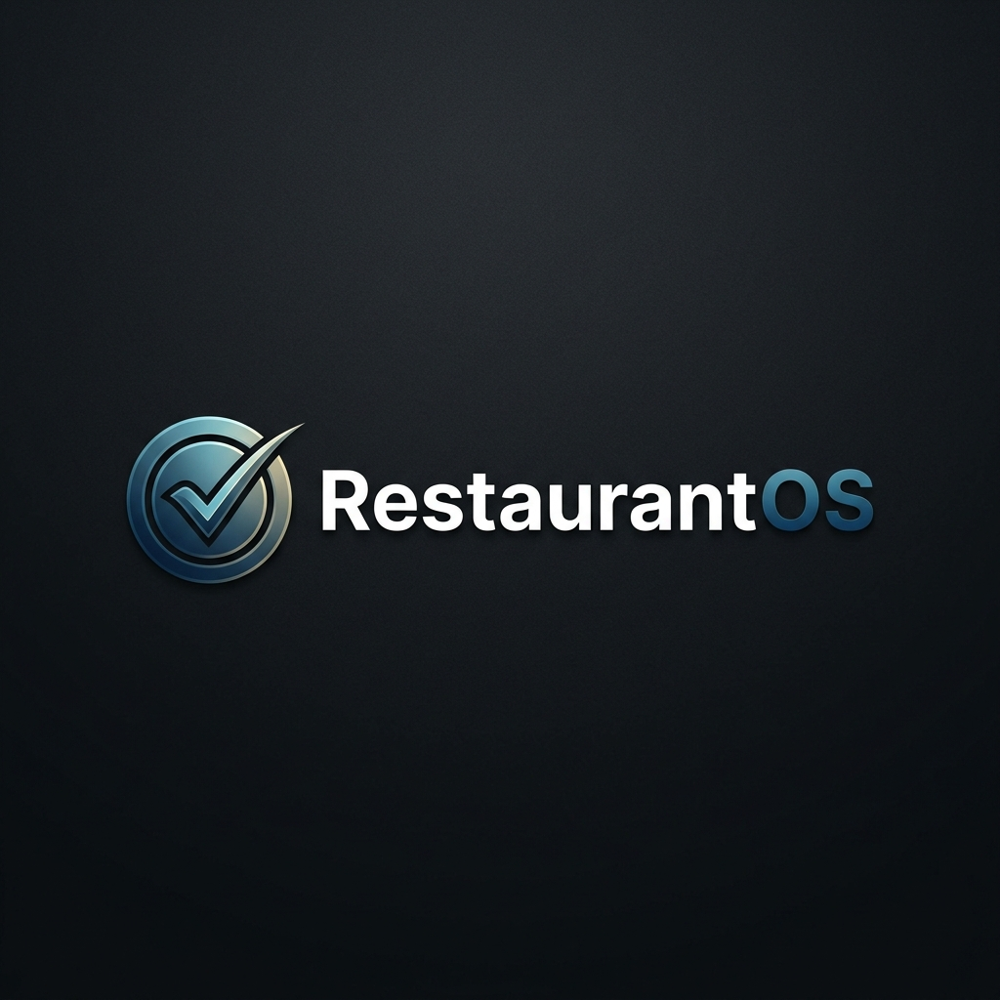

# RestaurantOS



## Overview
**RestaurantOS** is a premium, high-fidelity restaurant management ecosystem designed to streamline operations for modern dining establishments. From real-time order tracking to sophisticated kitchen display systems and interactive floor plans, RestaurantOS provides a unified dashboard for both back-of-house and front-of-house operations.

## Key Features
- **📊 Real-time Order Management**: Track every order from punch to payout with live status updates.
- **🍳 Kitchen Sync & Display (KDS)**: Instant KOT routing and kitchen timer management for zero delays.
- **🪑 Table Status & Management**: Interactive floor plans with real-time occupancy and billing status.
- **📦 Live Inventory Tracking**: Automated stock alerts and ingredient-level tracking for maximum efficiency.
- **🔐 Secure Access**: Role-based authentication with a dedicated Staff Login and Demo access.

## Tech Stack
- **Frontend**: React, Vite, TypeScript
- **Styling**: Tailwind CSS, Lucide Icons, Shadcn UI
- **Backend**: Supabase (Database & Auth)
- **Deployment**: Vercel

## Getting Started

### Prerequisites
- Node.js (v18 or higher)
- npm or bun

### Installation
1. Clone the repository:
   ```bash
   git clone https://github.com/Tusharjain-19/restaurantOS.git
   ```
2. Install dependencies:
   ```bash
   npm install
   # or
   bun install
   ```
3. Set up environment variables:
   Create a `.env` file in the root directory and add your Supabase credentials:
   ```env
   VITE_SUPABASE_URL=your_supabase_url
   VITE_SUPABASE_ANON_KEY=your_supabase_anon_key
   ```
4. Run the development server:
   ```bash
   npm run dev
   ```

## Demo Access
For testing purposes, you can use the **Demo Account** button on the login page:
- **Email**: `admin@restaurant.com`
- **Password**: `password123`

## License
© 2026 RestaurantOS. All rights reserved.
