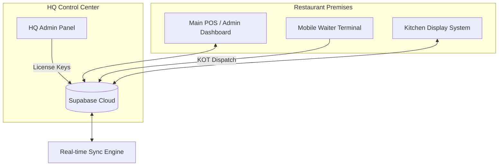

# 🍽️ RestaurantOS Ecosystem
> **The Enterprise-Grade Restaurant Operating System.**


**RestaurantOS** is a high-fidelity, distributed ecosystem designed to transform restaurant operations. It provides a seamless connection between the Front-of-House (Waiters), the Heart-of-House (Kitchen), and the Administrative HQ (Management).

---

## 🏗️ System Architecture



---

## 📦 Core Applications

### 1. 🖥️ Main POS & Admin Dashboard (`/restaurant-hub`)
The central nervous system of the restaurant. 
- **Dynamic Floor Plan**: Real-time table status (Occupied, Billed, Available).
- **Billing Engine**: Professional invoice generation with tax/discount logic.
- **Inventory Management**: Ingredient-level tracking with low-stock alerts.
- **Reporting & Analytics**: Financial insights with daily/monthly performance charts.
- **Staff Management**: Central control for staff roles and access levels.

### 2. 📱 Mobile Waiter Terminal (`/waiter-app`)
A Zomato-inspired, high-performance mobile application for waitstaff.
- **PIN-Based Login**: Ultra-fast access for staff using manager-assigned PINs.
- **Digital Menu**: Searchable, category-filtered menu with high-res dish imagery.
- **One-Tap KOT**: Instantly dispatch Kitchen Order Tickets (KOT) to the KDS.
- **Table Sync**: Live updates on table availability from the main dashboard.

### 3. 🌐 HQ Admin Panel (License Management)
Multi-tenant management portal for the software provider.
- **Client Onboarding**: Issue and manage licenses for multiple restaurants.
- **Master Credentials**: Controlled access to client environments.
- **Subscription Tracking**: Manage yearly renewals and license keys.

---

## 🛠️ Technology Stack

| Layer | Technology |
| :--- | :--- |
| **Frontend** | React 18, Vite 5, TypeScript |
| **State Management** | Zustand (Global), Dexie.js (Offline Cache) |
| **Database & Auth** | Supabase (PostgreSQL), Real-time Subscriptions |
| **Styling** | Tailwind CSS 3, Shadcn UI, Framer Motion |
| **Icons** | Lucide React |

---

## 🚀 Installation & Setup

### Prerequisites
- Node.js (v18+)
- Supabase Project URL & Anon Key

### Development Environment
The ecosystem is split into two primary workspaces:

#### **A. Setting up the Admin POS**
```bash
cd restaurant-hub
npm install
npm run dev
```
*Access at: `http://localhost:8080`*

#### **B. Setting up the Waiter Terminal**
```bash
cd waiter-app
npm install
npm run dev
```
*Access at: `http://localhost:3000`*

---

## 🔐 Authentication Guide

### Master Access (HQ)
To log in as a Master Administrator for a specific restaurant:
- **Email**: `Admin@nc.com` (Example from HQ Panel)
- **Password**: `admin123`
- *Note: These credentials bypass standard auth and link directly to the restaurant's license.*

### Staff Access (Waiter Terminal)
Staff members can log in using their **4-digit PIN** assigned in the Admin Dashboard.
- **Default PIN**: `1234` (Seed Data)

---

## 📜 Professional Features
- **Offline-First Resilience**: Critical POS operations continue even during internet outages using local Dexie caching.
- **Glassmorphism UI**: High-end "Zinc" design language for a premium terminal feel.
- **PWA Ready**: Can be installed as a native app on iOS/Android for a full-screen, browser-less experience.

---

## 📄 License
© 2026 RestaurantOS. All rights reserved. This software is proprietary and intended for professional restaurant management.

Developed with ❤️ by **The RestaurantOS Team**.
